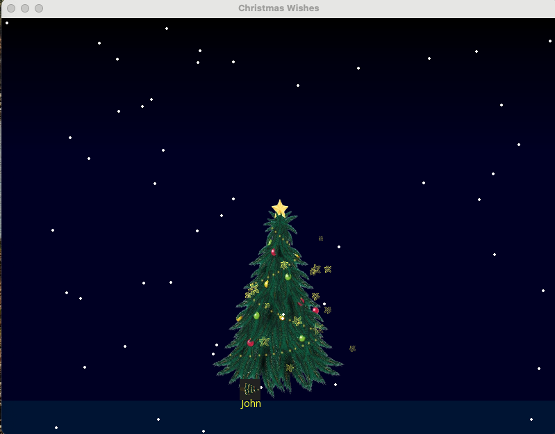
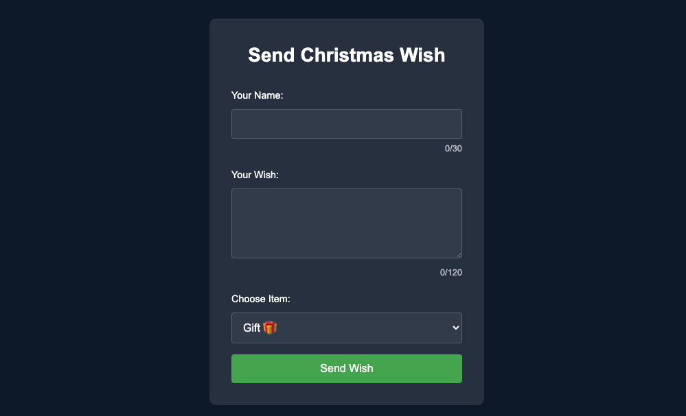

# Christmas Wishes Interactive Display

An interactive Christmas-themed display system that combines real-time wish displays with festive animations using Python, Pygame, and WebSocket technology.

## 📸 Screenshots

## 🎄 Features

- Real-time wish display system with WebSocket integration
- Interactive Santa animation that delivers wishes
- Physics-based gift dropping mechanics using Pymunk
- Dynamic snow particle effects
- Floating text animations for wishes
- Star particle effects around the Christmas tree
- Fullscreen toggle support
- Gradient night sky background

## 🎮 Game Elements

- **Santa Animation**: Flying Santa that drops gifts
- **Physics Engine**: Realistic gift dropping physics
- **Particle Systems**: 
  - Snow particles
  - Star light particles around the tree
- **Text Display**: Animated floating wishes
- **Interactive Elements**: Multiple gift types (gifts, stars, pine cones)

## 🛠️ Technical Stack

- Python 3.x
- Pygame for graphics and animation
- Pymunk for physics simulation
- WebSocket for real-time communication
- Asyncio for asynchronous operations

## 🎯 Requirements

- Python 3.x
- Pygame
- Pymunk
- Websockets
- AsyncIO

## 📦 Installation

1. Clone the repository
git clone [repository-url]
2. Install dependencies
    npm install
    pip install -r requirements.txt
3. Run server:
--node server.js

4. Run client:
--python mainws.py